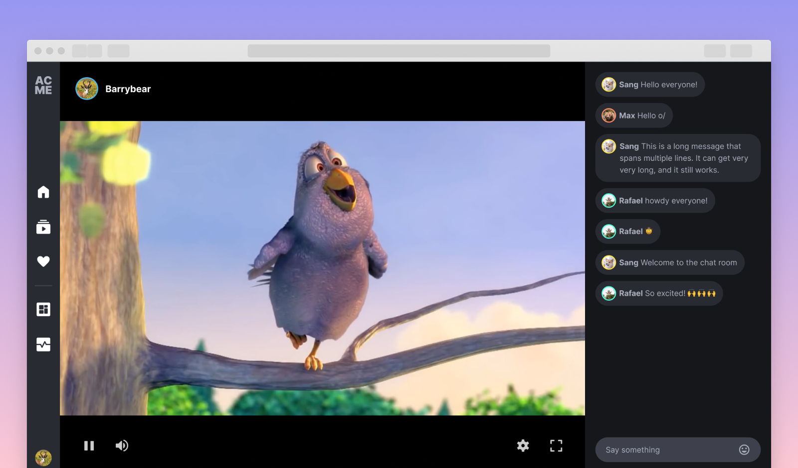
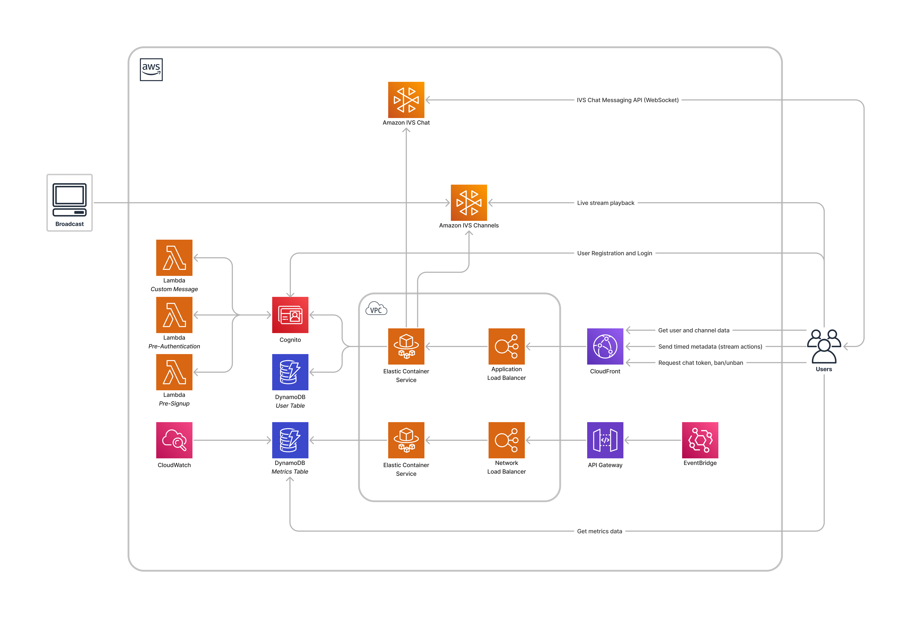

# Amazon IVS UGC web demo

A demo web application intended as an educational tool for demonstrating how customers can use Amazon IVS and other
AWS services to create a full-featured web application with user authentication, live stream playback, live chat messaging, interactive virtual experiences, stream monitoring, and much more.

This demo also uses [AWS Cloud Development Kit](https://aws.amazon.com/cdk/) (AWS CDK v2).



**This project is intended for educational purposes only and not for production usage.**

## Prerequisites

- AWS CLI ([Installing the AWS CLI version 2](https://docs.aws.amazon.com/cli/latest/userguide/install-cliv2.html))
- NodeJS ([Installing Node.js](https://nodejs.org/))
- Docker ([Installing Docker](https://www.docker.com/get-started/))

## To use and deploy this project

***IMPORTANT NOTE:** this demo will create and use AWS resources on your AWS account, which will cost money.*

Deploying the CDK stack will:

- create a Cognito User Pool to handle user sign-up and authentication
- create three Cognito triggers implemented with Lambda functions that are required for the user management flows
- create two DynamoDB tables to hold channels and stream metrics data
- create an Application Load Balancer and ECS Service that will act as the backend for the frontend application
- create a CloudFront distribution that sits in front of the backend service to handle incoming traffic from clients
- create an API Gateway, a Network Load Balancer and an ECS Service to handle EventBridge Amazon IVS events and store them in the Metrics DynamoDB table
- create an EventBridge rule to dispatch the Amazon IVS events to the aforementioned API Gateway

### Architecture



### Configuration

The `cdk/cdk.json` file provides two configuration objects: one for the `dev` stage and one for the `prod` stage. The configuration object (`resourceConfig` property) for each stage is set with sensible defaults but can be edited prior to deploying the stack:

- `allowedOrigins` is a list of origins (domain names) that the backend uses as the value for the `Access-Control-Allow-Origin` HTTP response header. This property is required in order for browsers to allow the requesting code (frontend application) running at an allowed origin domain to access our backend resources. You can use custom domains, or specify `["*"]` to allow all origins. To follow best security practices in a production environment, it is recommended to set this value to the domain(s) where you intend to deploy the frontend application.
- `clientBaseUrl` should be set to the base URL of the frontend application. This URL is used for sending verification emails with links that redirect the user back to the frontend application to complete the verification process.
- `deploySeparateContainers`, setting this to `true` will deploy the backend in two separate services, each one with the minimal required permissions. While being more costly, this option will scale better and is recommended for production.
- `enableUserAutoVerify`, setting this to `true` is not recommended for production. It will skip the email verification when a new user signs up in the app.
- `ivsChannelType` can be set to `BASIC` or `STANDARD`.
- `logRetention` is the number of days that the logs for the Cognito triggers will be kept. Omit this property to keep the logs forever.
- `maxAzs` is the maximum number of availability zones (AZs) for the VPC in the region that the stack is deployed. Setting this value to the maximum number of AZs in your region will reduce the risk of the backend going offline but also increase the running cost. If you pick a number that is higher than the amount of AZs in your region, then all the AZs in the region will be used. Therefore, to use all "all AZs" available to your account, specify a high number for this property (such as 99). While it is possible to use 1 AZ, we recommend using a minimum of 2 AZs to take advantage of the safety and reliability of geographic redundancy (i.e. when one AZ becomes unhealthy or unavailable, the unaffected AZ will be used instead).
- `minScalingCapacity` sets the lower limit of the number of tasks for Service Auto Scaling to use when running each of the backend services, ensuring that the backend services will not be automatically adjusted below this amount. You may increase this value if you're expecting high traffic in production. Alternatively, if you know that the backend services may be idle for a long period of time and you want to optimize for costs, you may set this value to 1.
- `natGateways`, at least one NAT Gateway is required for the tasks to fetch the Docker image from the ECR Repository. This value can be increased up to the `maxAzs` value in production.
- `signUpAllowedDomains` is a list of email domains that are allowed to be used when creating a new account in the app. An attempt to create an account with an email containing a domain that is not in this allowlist will be rejected. Setting this property to an empty list will allow all email domains to be used for account creation.

  Example:

  ```json
  "signUpAllowedDomains": ["example.com"]
  ```

### Deployment

***IMPORTANT NOTE:** Before setting up the backend, make sure that you have Docker running.*

1. To set up the backend, navigate to the `cdk` directory and run:

   ```shell
   make app
   ```

   This command will install dependencies, bootstrap the CDK assets (if needed), and finally deploy the stack. By default, the `make app` command will deploy the stack using the `dev` stage configuration. To specify a different deployment stage, you will need to set the `STAGE` environment variable to either "dev" or "prod" in the `make app` command. For instance, to deploy the `prod` stage configuration, run the following command:

   ```shell
   make app STAGE=prod
   ```

   Optionally, you may also specify the AWS named profile to use when deploying the stack using the `AWS_PROFILE` environment variable:

   ```shell
   make app AWS_PROFILE=user1
   ```

   Additionally, you can also build and publish the frontend application to an S3 bucket with a CloudFront distribution as part of the same deployment by setting the `PUBLISH` flag to `true`:

   ```shell
   make app PUBLISH=true
   ```

   Deploying with the `PUBLISH` flag set to `true` will also append the CloudFront distribution URL to the list of `allowedOrigins` defined in your `cdk.json` config. It will also override the value of `clientBaseUrl`.

   ***NOTE:** the deployment might take up to 20 minutes or more if you are also publishing the frontend application.*

2. Go to the `web-ui` directory and run the following commands to start the React frontend host:

   ```shell
   npm install
   npm start
   ```

Running `make app` is only required when you deploy the stack for the first time. Subsequent re-deployments will run faster with the following command (be sure to specify the `STAGE` value if you are deploying to a stage other than `dev`):

```shell
make deploy STAGE=<stage>
```

If you have initially deployed the stack with the `PUBLISH` flag set to `true`, make sure to set it again, every time you re-deploy. If you don't, the stack will take down the existing deployment.

Additionally, if you want to make changes to any of the stage configuration options after the stack has been deployed, you will need to re-deploy the stack in order for the changes to take effect. For instance, say that you deployed the stack under the `prod` stage and then decided to update the `allowedOrigins` value in the configuration options. After updating the `cdk.json` file, you will then need to run the following command to re-deploy the `prod` stack with the new changes:

```shell
make deploy STAGE=prod
```

#### Summary

The following recaps all the most common commands that you can run to easily deploy the app to AWS.  
***NOTE:** if you are running the command for the first time, you need to replace `deploy` with `app` in the `make` command.*

Deploy the backend with the "dev" config:

```shell
make deploy
```

Deploy the backend and the frontend app with the "dev" config:

```shell
make deploy PUBLISH=true
```

Deploy the backend with the "prod" config:

```shell
make deploy STAGE=prod
```

Deploy the backend and the frontend app with the "prod" config:

```shell
make deploy STAGE=prod PUBLISH=true
```

## Backend Specification

An in-depth specification of the backend API can be found in the Postman collection ([cdk/postman](./cdk/postman)), along with instructions on how to call each individual endpoint.

## Backend Teardown

To avoid unexpected charges to your account, be sure to destroy the CDK stack when you are finished:

1. In the `cdk` directory, run:

   ```shell
   make destroy
   ```

This command will delete all the AWS resources that were created for this demo, with the exception of the Amazon IVS channels and Amazon IVS chat rooms. These Amazon IVS resources will have to be manually stopped, in the case of channels that are still live, and deleted from the AWS console. Any channels that remain in offline status or chat rooms that have not been deleted will not incur charges to your account.

Additionally, the `make destroy` command will also run a clean-up process that will delete the cloud assembly directory (`cdk.out`).

More information about all the available `make` rules can be found by navigating to the `cdk` directory and running:

```shell
make help
```

## Testing

Two types of testing were incorporated into this demo: unit testing for the backend API and end-to-end testing for the React web app.

### Backend Unit Testing

Unit testing is run on the backend API using [Jest](https://jestjs.io/).

1. To run the backend unit tests, navigate to the `cdk/api` directory and run:

   ```shell
   npm run test
   ```

Currently, the backend unit testing suite covers only the metrics API and the `buildServer.ts` file, while the channels API is only partially covered.

### End-to-end Testing

End-to-end tests are written using the [Playwright](https://playwright.dev/) web testing framework, which allows us to run our tests across Chromium, Firefox and WebKit browsers, on both desktop and mobile.

1. To run the E2E tests, navigate to the `web-ui` directory and run:

   ```shell
   npm run test:e2e
   ```

Currently, the E2E testing suite covers only the most common user management flows.

### Automated Testing

Testing is automated using two GitHub Actions workflows: one for running the backend unit tests (`backend-unit-test-on-pull-request`) and another for running the E2E tests (`e2e-test-on-pull-request`). Each workflow is configured to run on every pull request made to the `master` branch. Additionally, to save on GitHub Actions execution minutes, the backend unit testing workflow is run only if changes were made to the files inside the `cdk/api` directory, and the E2E testing workflow is run only if changes were made to the files inside the `web-ui` directory. In the instance that the E2E workflow fails at the testing step, an artifact will be generated containing the playwright test report. These artifacts have a retention period of 7 days, after which they are automatically deleted from the workflow run results.

## Limitations

- In the Metrics DynamoDB table, the metrics data is overwritten in order to decrease the resolution of the data as per the [CloudWatch schedule](https://docs.aws.amazon.com/ivs/latest/userguide/cloudwatch.html)
- While this demo relies on EventBridge to gather information about a user's stream(s), the streaming configuration details are still retrieved from the Amazon IVS API. Therefore, during high traffic conditions, these requests may be throttled once the 5 TPS [quota limit](https://docs.aws.amazon.com/ivs/latest/userguide/service-quotas.html) is reached. From the users' perspective, there may be a delay before the streaming configuration details are available; however this delay will only occur once per stream, as they are immediately saved in the DynamoDB table once retrieved from the Amazon IVS API.
- By default, Cognito will send user account-related emails using a Cognito-hosted domain, which are limited to 50 emails / day per account. If you wish to increase the email delivery volume, you will need to configure your Cognito user pool to use Amazon SES configured with your own domain. For more information, see [Email settings for Amazon Cognito user pools](https://docs.aws.amazon.com/cognito/latest/developerguide/user-pool-email.html).
- The ECS tasks that are deployed as part of the backend infrastructure require public internet access to fetch the corresponding Docker image from the ECR repository. To enable the ECS tasks to access the public internet, and therefore the ECR repository, we have to create NAT Gateways - 1 for dev and 2 for prod, by default - and associate them with a VPC. There is a limit of 5 NAT Gateways per availability zone. If your account is already at this limit, attempting to deploy the infrastructure for the demo will fail. To solve this issue, you can either remove unused NAT Gateways from the current region or deploy the stack in a different region by modifying the `cdk/bin/cdk.ts` file as follows:

  ```typescript
  const region = <your-region-here>
  ```

  Alternatively, you may also choose to [request a quota increase](https://console.aws.amazon.com/servicequotas/home/services/vpc/quotas) for "NAT gateways per Availability Zone" and "VPCs per Region."

- iOS devices do not currently support the fullscreen API, which prevents us from offering a fullscreen player experience that includes the custom player controls and header as we do on desktop devices. The current workaround that has been implemented is to initiate the default WebKit fullscreen mode, which uses the native iOS video player UI.
- Due to iOS-specific limitations, the volume level of the video player is always under the user's physical control and not settable using JavaScript. The implication of this limitation is that iOS only allows us to mute and unmute the volume, but not set it to a specific value as this can only be done by using the physical volume buttons on the device. To deal with this limitation, on iOS devices only, setting the volume control on the player to zero will mute the audio, while setting it to any level above zero will unmute and play the audio at the current volume level set on the device.
- Currently only tested in the us-west-2 (Oregon) and us-east-1 (N. Virginia) regions. Additional regions may be supported depending on service availability.
- The user registration flow involves the creation and coordination of multiple AWS resources, including the Cognito user pool, the Amazon IVS channel and chat room, and the DynamoDB channels table. This registration flow also includes important validation checks to ensure that the submitted data meets a set of constraints before the user is allowed to sign up for a new account. Therefore, we highly advise against creating or managing any user account from the AWS Cognito console or directly from the DynamoDB channels table as any such changes will be out of sync with the other user-related AWS resources. If at any point you see an error message pertaining to a manual change that was made from the AWS Cognito console (e.g. a password reset), a new account should be created using the frontend application's dedicated registration page.

## Estimated costs

For this estimation, we considered the usage costs associated with 1, 10 and 100 users, where each "user" is assumed to monitor one 4-hour live stream with 1 viewer. In each scenario, we assumed that there were no more than 10,800 chat messages sent by the end of the 4-hour stream. Additionally, the estimated costs below reflect the usage costs of running the production configuration of the CDK stack.

### Overall pricing

| Service                                                              | 1 user | 10 users | 100 users |
| -------------------------------------------------------------------- | -----: | -------: | --------: |
| [API Gateway](https://aws.amazon.com/api-gateway/pricing/)           | <$0.01 |   <$0.01 |    <$0.01 |
| [CloudFront](https://aws.amazon.com/cloudfront/pricing/)             | <$0.01 |    $0.04 |     $0.38 |
| [CloudWatch](https://aws.amazon.com/cloudwatch/pricing/)             |  $0.29 |    $2.90 |    $29.00 |
| [Cognito](https://aws.amazon.com/cognito/pricing/)                   | <$0.01 |    $0.06 |     $0.55 |
| [DynamoDB](https://aws.amazon.com/dynamodb/pricing/on-demand/)       | <$0.01 |   <$0.01 |    <$0.01 |
| [Elastic Container Registry](https://aws.amazon.com/ecr/pricing/)    | <$0.01 |   <$0.01 |    <$0.01 |
| [Elastic Container Service](https://aws.amazon.com/fargate/pricing/) |  $0.13 |    $0.13 |     $0.13 |
| [EventBridge](https://aws.amazon.com/eventbridge/pricing/)           | <$0.01 |   <$0.01 |    <$0.01 |
| [Interactive Video Service](https://aws.amazon.com/ivs/pricing/)     |  $8.60 |   $86.00 |   $860.00 |
| [Lambda](https://aws.amazon.com/lambda/pricing/)                     | <$0.01 |   <$0.01 |    <$0.01 |
| Total cost                                                           |  $9.09 |   $89.18 |   $890.11 |

## About Amazon IVS

Amazon Interactive Video Service (Amazon IVS) is a managed live streaming solution that is quick and easy to set up, and ideal for creating interactive video experiences. [Learn more](https://aws.amazon.com/ivs/).

- [Amazon IVS docs](https://docs.aws.amazon.com/ivs/)
- [User Guide](https://docs.aws.amazon.com/ivs/latest/userguide/)
- [API Reference](https://docs.aws.amazon.com/ivs/latest/APIReference/)
- [Setting Up for Streaming with Amazon Interactive Video Service](https://aws.amazon.com/blogs/media/setting-up-for-streaming-with-amazon-ivs/)
- [Learn more about Amazon IVS on IVS.rocks](https://ivs.rocks/)
- [View more demos like this](https://ivs.rocks/examples)

## Security

See [CONTRIBUTING](CONTRIBUTING.md#security-issue-notifications) for more information.

## License

This library is licensed under the MIT-0 License. See the LICENSE file.
