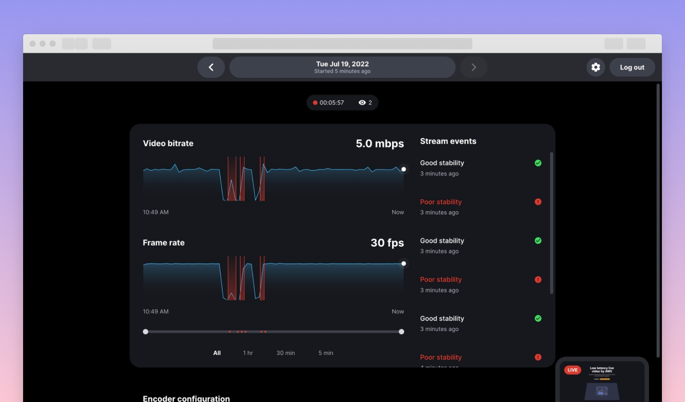

# Amazon IVS UGC web demo

A demo web application intended as an educational tool for demonstrating how you can implement a ... [TODO]

This demo also uses [AWS Cloud Development Kit](https://aws.amazon.com/cdk/) (AWS CDK v2).



**This project is intended for education purposes only and not for production usage.**

## Prerequisites

- AWS CLI ([Installing the AWS CLI version 2](https://docs.aws.amazon.com/cli/latest/userguide/install-cliv2.html))
- NodeJS ([Installing Node.js](https://nodejs.org/))
- Docker ([Installing Docker](https://www.docker.com/get-started/))

## To use and deploy this project

**\*IMPORTANT NOTE:** this demo will create and use AWS resources on your AWS account, which will cost money.\*

Deploying the CDK stack will:

- create a Cognito User Pool to handle user signup and authentication
- create three Cognito triggers Lambda functions that are required for the user management flows
- create DynamoDB User and Metrics tables to hold user and stream data
- create a Load Balancer and ECS Service that will handle act as the backend for the frontend application
- create a CloudFront distribution and set it up in front of the backend to handle traffic from the clients
- create an API Gateway, a Load Balancer and an ECS Service to handle EventBridge IVS events and store them in the Metrics DynamoDB table
- create an EventBridge rule to dispatch the IVS events to the above API Gateway

### Architecture


### Configuration

The `cdk/cdk.json` file provides two configuration objects: one for the `dev` stage and one for the `prod` stage. The configuration object (`resourceConfig` property) for each stage comes with sensible defaults but can be edited prior to deploying the stack:

- `allowedOrigin` is the origin (domain name) that the backend uses as the value for the `Access-Control-Allow-Origin` HTTP response header. You can use a custom domain, or specify `"*"` to allow all origins.
- `deploySeparateContainers`, setting this to `true` will deploy the backend in two separate services, each one with the minimal required permissions. While being more costly, this option will scale better and is recommended for production.
- `enableUserAutoVerify`, setting this to `true` is not recommended for production. It will skip the email verification when a new user signs up in the app.
- `ivsChannelType` can be set to `BASIC` or `STANDARD`.
- `logRetention` is the number of days that the logs for the Cognito triggers will be kept. Omit this property to keep the logs forever.
- `maxAzs` is the maximum number of availability zones for the VPC that will hold the backend. Setting this value to the maximum number of availability zones in your region will reduce the risk of the backend going offline but also increase the running cost.
- `minScalingCapacity` sets the minimum number of tasks to run for each of the backend services. You can increase this value if you're expecting high traffic on production.
- `natGateways`, at least one NAT Gateway is required for the tasks to fetch the Docker image from the ECR Repository. This value can be increased up to the `maxAzs` value in production.
- `clientBaseUrl` should be set to the base URL of the frontend application.

### Deployment

**\*IMPORTANT NOTE:** Before setting up the backend, make sure that you have Docker running.\*

1. To set up the backend, navigate to the `cdk` directory and run:

   ```shell
   make app
   ```

   This command will install dependencies, bootstrap the CDK assets (if needed), and finally deploy the stack.

   **\*NOTE:** the deployment might take up to 15 minutes.\*

2. Go to the `web-ui` directory and run the following commands to start the React frontend host:

   ```shell
   npm install
   npm start
   ```

## Backend Specification

An in-depth specification of the backend API can be found in the Postman collection ([cdk/postman](./cdk/postman)), along with instructions on how to call each individual endpoint.

## Backend Teardown

To avoid unexpected charges to your account, be sure to destroy the CDK stack when you are finished:

1. In the `cdk` directory, run:

   ```shell
   make destroy
   ```

This command will delete all the AWS resources that were created for this demo, with the exception of the IVS channels. These IVS channels will have to be manually stopped, if they happen to still be live, and deleted from the AWS console. Any channels that remain in offline status will not incur charges to your account.

Additionally, the `make destroy` command will also run a clean-up process that will delete the cloud assembly directory (`cdk.out`).

More information about all the available `make` rules can be found by navigating to the `cdk` directory and running:

```shell
make help
```

## Testing

Two types of testing were incorporated into this demo: unit testing for the backend API and end-to-end testing for the React web app.

### Backend Unit Testing

Unit testing is run on the backend API using [Jest](https://jestjs.io/).

1. To run the backend unit tests, navigate to the `cdk/api` directory and run:

   ```shell
   npm run test
   ```

Currently, the backend unit testing suite covers only the metrics API and the `buildServer.ts` file.

### End-to-end Testing

End-to-end tests are written using the [Playwright](https://playwright.dev/) web testing framework, which allows us to run our tests across Chromium, Firefox and WebKit browsers, on both desktop and mobile.

1. To run the E2E tests, navigate to the `web-ui` directory and run:

   ```shell
   npm run test:e2e
   ```

Currently, the E2E testing suite covers only the most common user management flows.

### Automated Testing

Testing is automated using two GitHub Actions workflows: one for running the backend unit tests (`backend-unit-test-on-pull-request`) and another for running the E2E tests (`e2e-test-on-pull-request`). Each workflow is configured to run on every pull request made to the `master` branch. Additionally, to save on GitHub Actions execution minutes, the backend unit testing workflow is run only if changes were made to the files inside the `cdk/api` directory, and the E2E testing workflow is run only if changes were made to the files inside the `web-ui` directory.

## Limitations

- In the Metrics DynamoDB table, the metrics data is overwritten in order to decrease the resolution of the data as per the [CloudWatch schedule](https://docs.aws.amazon.com/ivs/latest/userguide/cloudwatch.html)
- While this demo relies on EventBrige to gather information about a user's stream(s), the streaming configuration details are still retrieved from the IVS API. Therefore, during high traffic conditions, these requests may be throttled once the 5 TPS [quota limit](https://docs.aws.amazon.com/ivs/latest/userguide/service-quotas.html) is reached. From the users' perspective, there may be a delay before the streaming configuration details are available; however this delay will only occur once per stream, as they are immediately saved in the DynamoDB table once retrieved from the IVS API.
- By default, Cognito will send user account-related emails using a Cognito-hosted domain, which are limited to 50 emails / day per account. If you wish to increase the email delivery volume, you will need to configure your Cognito user pool to use Amazon SES configured with your own domain. For more information, see [Email settings for Amazon Cognito user pools](https://docs.aws.amazon.com/cognito/latest/developerguide/user-pool-email.html).
- The ECS tasks that are deployed as part of the backend infrastructure require public internet access to fetch the corresponding Docker image from the ECR repository. To enable the ECS tasks to access the public internet, and therefore the ECR repository, we have to create NAT Gateways - 1 for dev, and 2 for prod, by default - and associate them with a VPC. There is a limit of 5 NAT Gateways per availability zone. If your account is already at this limit, attempting to deploy the infrastructure for the demo will fail. To solve this issue, you can either remove unused NAT Gateways from the current region or deploy the stack in a different region by modifying the `cdk/bin/cdk.ts` file as follows:

  ```typescript
  new UGCStack(new App(), `UGC-${stage}`, {
  env: {
     account: process.env.CDK_DEFAULT_ACCOUNT,
     region: <your-region-here>
  },
  resourceConfig
  });
  ```

## Estimated costs

For this estimation, we considered the usage costs associated with 1, 10 and 100 users, where each "user" is assumed to monitor one 4-hour live stream with 1 viewer. Additionally, the estimated costs below reflect the usage costs of running the production configuration of the CDK stack.

### Overall pricing

| Service                                                              | 1 user | 10 users | 100 users |
| -------------------------------------------------------------------- | -----: | -------: | --------: |
| [API Gateway](https://aws.amazon.com/api-gateway/pricing/)           | <$0.01 |   <$0.01 |    <$0.01 |
| [CloudFront](https://aws.amazon.com/cloudfront/pricing/)             | <$0.01 |    $0.04 |     $0.38 |
| [CloudWatch](https://aws.amazon.com/cloudwatch/pricing/)             |  $0.29 |    $2.90 |    $29.00 |
| [Cognito](https://aws.amazon.com/cognito/pricing/)                   | <$0.01 |    $0.06 |     $0.55 |
| [DynamoDB](https://aws.amazon.com/dynamodb/pricing/on-demand/)       | <$0.01 |   <$0.01 |    <$0.01 |
| [Elastic Container Registry](https://aws.amazon.com/ecr/pricing/)    | <$0.01 |   <$0.01 |    <$0.01 |
| [Elastic Container Service](https://aws.amazon.com/fargate/pricing/) |  $0.13 |    $0.13 |     $0.13 |
| [EventBridge](https://aws.amazon.com/eventbridge/pricing/)           | <$0.01 |   <$0.01 |    <$0.01 |
| [Interactive Video Service](https://aws.amazon.com/ivs/pricing/)     |  $8.60 |   $86.00 |   $860.00 |
| [Lambda](https://aws.amazon.com/lambda/pricing/)                     | <$0.01 |   <$0.01 |    <$0.01 |
| Total cost                                                           |  $9.09 |   $89.18 |   $890.11 |

## About Amazon IVS

Amazon Interactive Video Service (Amazon IVS) is a managed live streaming solution that is quick and easy to set up, and ideal for creating interactive video experiences. [Learn more](https://aws.amazon.com/ivs/).

- [Amazon IVS docs](https://docs.aws.amazon.com/ivs/)
- [User Guide](https://docs.aws.amazon.com/ivs/latest/userguide/)
- [API Reference](https://docs.aws.amazon.com/ivs/latest/APIReference/)
- [Setting Up for Streaming with Amazon Interactive Video Service](https://aws.amazon.com/blogs/media/setting-up-for-streaming-with-amazon-ivs/)
- [Learn more about Amazon IVS on IVS.rocks](https://ivs.rocks/)
- [View more demos like this](https://ivs.rocks/examples)

## Security

See [CONTRIBUTING](CONTRIBUTING.md#security-issue-notifications) for more information.

## License

This library is licensed under the MIT-0 License. See the LICENSE file.
