# Amazon IVS UGC web demo

A demo web application intended as an educational tool for demonstrating how you can use Amazon IVS, in conjunction with other AWS services, to create a full-featured web application with user authentication, live video playback, live chat messaging, interactive virtual experiences, stream monitoring, and more.

This demo uses [AWS Cloud Development Kit](https://aws.amazon.com/cdk/) (AWS CDK v2).


**This project is intended for educational purposes only and not for production usage.**

## Prerequisites

- AWS CLI ([Installing the AWS CLI version 2](https://docs.aws.amazon.com/cli/latest/userguide/install-cliv2.html))
- NodeJS ([Installing Node.js](https://nodejs.org/))
- Docker ([Installing Docker](https://www.docker.com/get-started/))

## To use and deploy this project

***IMPORTANT NOTE:** this demo will create and use AWS resources on your AWS account, which will cost money.*

Deploying the CDK stack will:

- create a Cognito User Pool to handle user sign-up and authentication
- create three Cognito triggers implemented with Lambda functions that are required for the user management flows
- create two DynamoDB tables to hold channels and stream metrics data
- create an Application Load Balancer and ECS Service that will act as the backend for the frontend application
- create a CloudFront distribution that sits in front of the backend service to handle incoming traffic from clients
- create an API Gateway, a Network Load Balancer and an ECS Service to handle EventBridge Amazon IVS events and store them in the Metrics DynamoDB table
- create an EventBridge rule to dispatch the Amazon IVS events to the aforementioned API Gateway
- create the Secrets Manager with the necessary secret(s) depending on the enabled features

## Quick links 🔗

- [Configure the demo](#configuration)
- [Deploy the demo](#deployment)
- [Known limitations](#limitations)

## Architecture

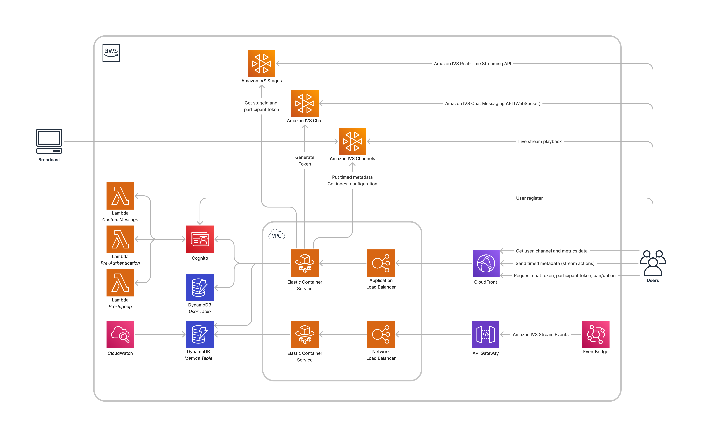

## Features

This section lists the different user flows and features that are available in this app. For each feature, there will be a screenshot from the user's point of view and an architecture diagram to explain the supporting backend flow in isolation.

### User Registration, Login and Password Reset

New users can create an account from the `/register` route. Returning users can login to their account from the `/login` route. They can also reset their password at `/reset`.

While no two accounts can share the same username and email, it is possible to create a new account with the same username and email after deleting the previous account.


On the first login, the required resources will be created on the backend and associated with the user account (each user gets their own IVS channel and IVS chatroom).

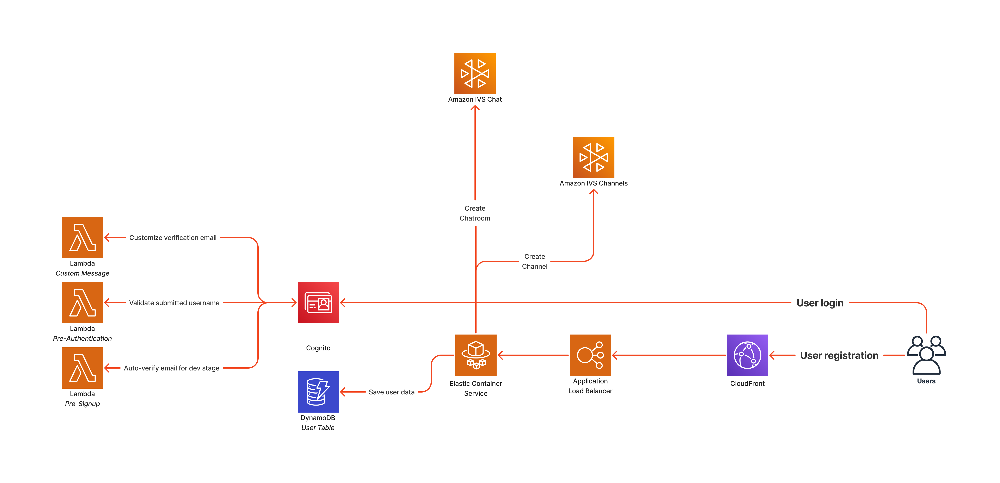

### Channel page


Each registered user has a channel page where viewers can watch the stream and chat together. The route for a channel page is based on the username, e.g.: `/<username>`. Both authenticated and unauthenticated users can access a channel page.

#### GetChannelData

The playback URL and the streamer information are retrieved directly from the database.


#### Follow channel button

Authenticated users can add or remove a channel from their following list by clicking the follow/unfollow button on a user's channel of their choice. Unauthenticated users who click on the follow button are redirected to the login page to sign in or create a new account. Once logged in, the user is redirected back to the same channel page they were trying to follow earlier and the channel will be automatically followed for them on page load.

#### Chat

Each channel has a corresponding chatroom which is accessible from the channel page.


Authenticated viewers are able to read and send messages. Unauthenticated users are only able to read messages. The owner of the channel can moderate their chatroom and delete messages or ban users from their channel.


#### Stream overlays

Currently, streamers can trigger five different stream overlays: host a quiz, feature a product, feature an Amazon product, show a notice and trigger a celebration. More information on how overlays are triggered by streamers is available in the following section: [Trigger overlays](#stream-overlay-configuration).

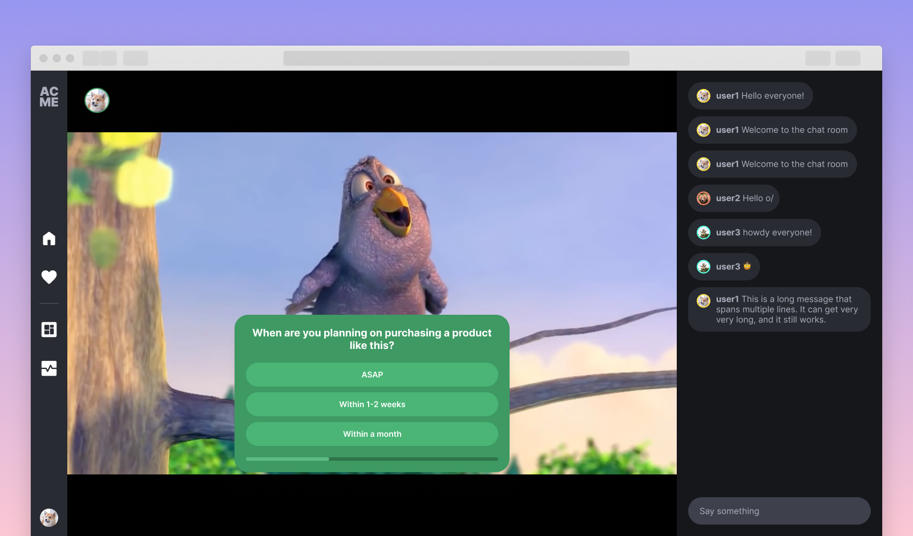


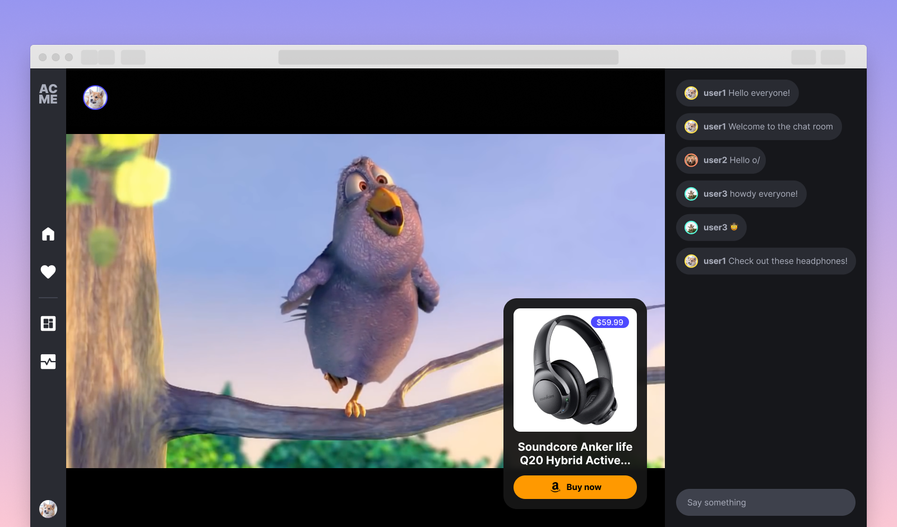

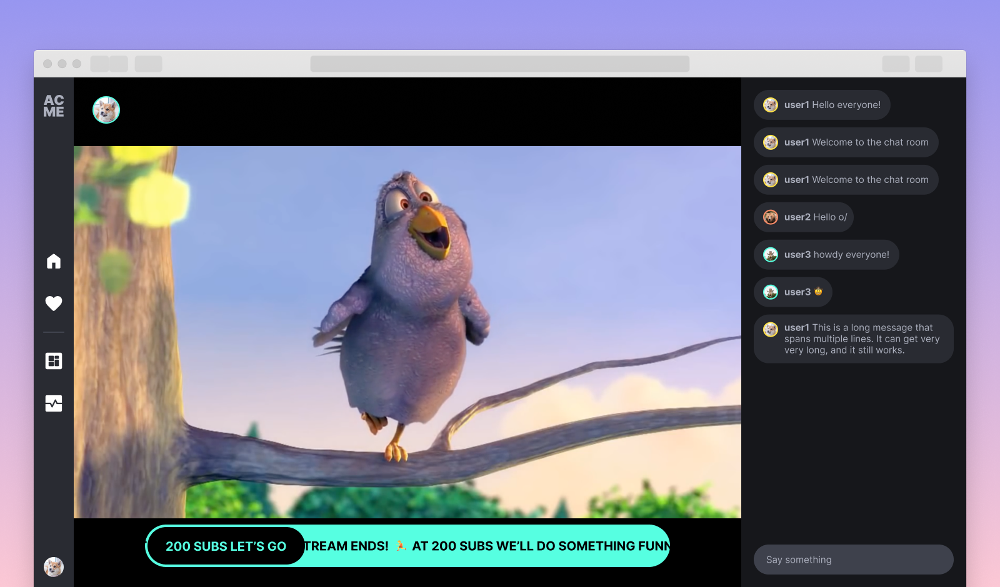

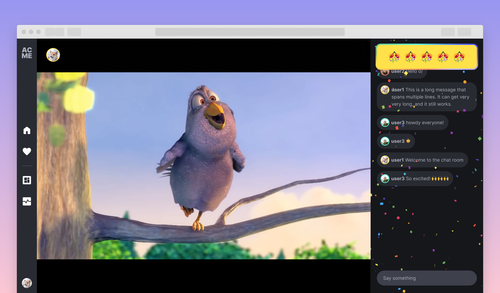

The stream actions are received by the viewers through the IVS Player using [Timed Metadata](https://docs.aws.amazon.com/ivs/latest/userguide/metadata.html).

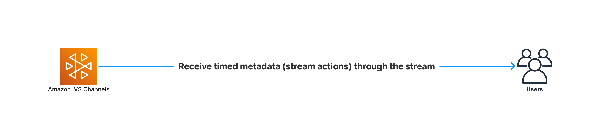

### Stream health monitoring

The Stream Health page is only accessible to authenticated users, from the `/health` URL. It enables streamers to monitor live and past stream sessions. For each session, the page will show the stream events, the video bitrate and frame rate in the form of charts and a summary of the encoder configuration at the time of go-live. [Learn more](https://docs.aws.amazon.com/ivs/latest/userguide/stream-health.html)


#### Stream events

Stream events are being sent by [EventBridge](https://docs.aws.amazon.com/ivs/latest/userguide/eventbridge.html) to a service that is responsible for storing them into the database. They are organized by stream session so they can easily be retrieved when a user monitors a specific stream session.


#### Stream metrics

The video bitrate, frame rate, concurrent views and keyframe interval metrics come from CloudWatch. For live sessions, the metrics are polled from CloudWatch at regular intervals and are not cached to ensure only the latest data is served. When monitoring an offline session, the metrics are fetched from CloudWatch and stored in the database so they can be retrieved faster.


### Stream management

The stream management page is only accessible to authenticated users, from the `/manager` URL. On this page, streamers can start a web broadcast, trigger stream overlays, as well as monitor and moderate their chatroom. Users can also prepare and save stream overlay configurations for later use.

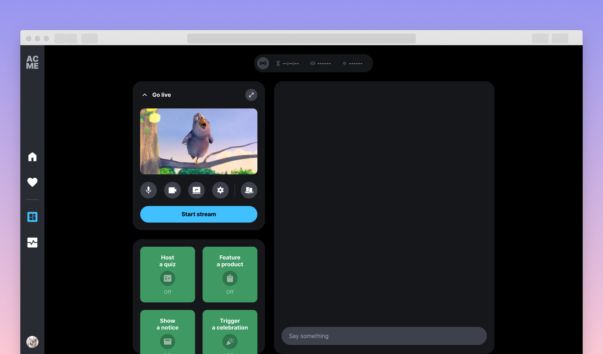

#### Web broadcast

Users are prompted to grant camera and microphone access when accessing the `/manager` URL, ensuring proper device access for broadcasting. The user must allow both the camera and microphone permissions to use this feature. Users can toggle camera, microphone, and screen sharing options. Users have control over various settings such as changing camera and microphone devices, and toggling the option to show their camera when sharing their screen. The application provides a full-screen view option and ends the stream when a user leaves the page or clicks the `end stream` button.

Read more about Amazon IVS Web broadcast from the [official SDK guide](https://aws.github.io/amazon-ivs-web-broadcast/docs/sdk-guides/introduction).

Read about [web broadcast known issues and limitations](#web-broadcast-known-issues).

#### Chat monitoring

The chat component on this page works exactly like the chat component from the Channel page. More information and an architecture diagram are available in the [corresponding section](#chat))

#### Stream overlay configuration

Streamers can trigger any of the five stream overlays supported on [the viewer side](#stream-overlays). Only one stream action can be active at any given moment. A stream action will remain active until the action expires, until it is stopped or until it is replaced by a different action.

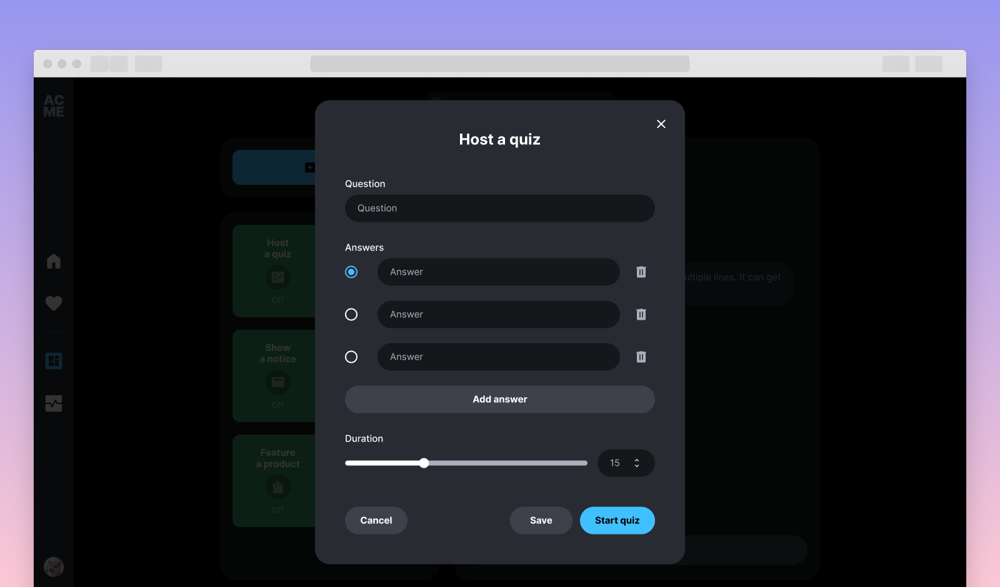

The stream actions are sent to viewers using the [PutMetadata Endpoint](https://docs.aws.amazon.com/ivs/latest/APIReference/API_PutMetadata.html).


#### Monetize affiliate links (Amazon Product stream action)

With the Amazon Product stream action enabled (see [Stream overlay configuration section](#stream-overlay-configuration)), through [Amazon OneLink](https://affiliate-program.amazon.com/resource-center/onelink-launch), you can best earn money via product affiliate links by redirecting international traffic to the appropriate Amazon store for their location, increasing the likelihood that they will make a purchase. To get started:

1. Sign up for Amazon Associates: To use Amazon OneLink, you need to be an [Amazon Associate](https://associates.amazon.ca/). If you're not already signed up, go to the Amazon Associates website and create an account.

2. Enable OneLink: Once you've signed up for Amazon Associates, go to the OneLink section of your account dashboard and enable OneLink for your account.

3. To track a channel, you must first obtain the channel's `trackingId` (ex. Xzhsymq-20). To locate it, you can simply go to the channel's DynamoDB table (in the AWS console), locate the channel of interest and copy and paste the `trackingId` into Amazon OneLink. Note: the id is composed of the channel's id followed by the region code (productLinkRegionCode) that was set on stack deployment.

3. Test your links (by clicking the Buy now button) to make sure they are redirecting to the correct Amazon store for the visitor's location.

4. Monitor your earnings: Keep track of your earnings through the Amazon Associates dashboard. You can see how many clicks and purchases you've received from each Amazon store.

### Settings Page

From the settings page (`/settings`), registered users can select a profile color, change their avatar and profile banner, get and update their account information or delete their account. Deleting an account will delete its associated resources (IVS channel and IVS chatroom). A "Go live from web" button in the stream settings section allows for quick access to the stream manager page, where users can start their live stream.

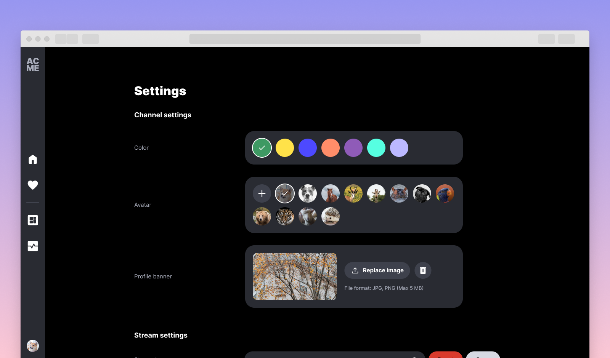

#### Get and Update User Information

All the user information is stored in the database. The data is retrieved or updated using the regular authenticated flow through the Cognito authorizer and then by a container calling the database.


### Directory page

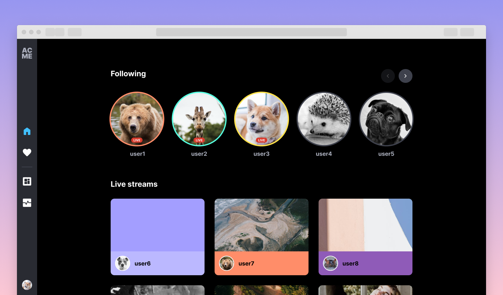

The directory page (`/`) is where all users can view the 50 most recent live streams, while authenticated users will also be able to see up to 14 of the channels they follow in a carousel at the top. Within the following list, the live channels appear first and are sorted in order of most recent start time. The offline channels follow after the live channels and are sorted in order of most recently added.

### Following page


Authenticated users have a following page (`/following`) where they can view the channels they are following, along with the live status of each channel.

#### Get and update following list

Each registered user has a following channels list that is stored in the database and contains the channel IDs of the channels the user follows. When a user follows or unfollows a channel, the database is updated to reflect the change by adding or removing the respective channel ID from the list. The data is retrieved or updated using the regular authenticated flow through the Cognito authorizer and then by a container calling the database.


## Configuration

The `cdk/cdk.json` file provides two configuration objects: one for the `dev` stage and one for the `prod` stage. The configuration object (`resourceConfig` property) for each stage is set with sensible defaults but can be edited prior to deploying the stack:

- `allowedOrigins` is a list of origins (domain names) that the backend uses as the value for the `Access-Control-Allow-Origin` HTTP response header. This property is required in order for browsers to allow the requesting code (frontend application) running at an allowed origin domain to access our backend resources. You can use custom domains, or specify `["*"]` to allow all origins. To follow best security practices in a production environment, it is recommended to set this value to the domain(s) where you intend to deploy the frontend application.
- `clientBaseUrl` should be set to the base URL of the frontend application. This URL is used for sending verification emails with links that redirect the user back to the frontend application to complete the verification process.
- `deploySeparateContainers`, setting this to `true` will deploy the backend in two separate services, each one with the minimal required permissions. While being more costly, this option will scale better and is recommended for production.
- `enableUserAutoVerify`, setting this to `true` is not recommended for production. It will skip the email verification when a new user signs up in the app.
- `ivsChannelType` can be set to `BASIC` or `STANDARD`.
- `logRetention` is the number of days that the logs for the Cognito triggers will be kept. Omit this property to keep the logs forever.
- `maxAzs` is the maximum number of availability zones (AZs) for the VPC in the region that the stack is deployed. Setting this value to the maximum number of AZs in your region will reduce the risk of the backend going offline but also increase the running cost. If you pick a number that is higher than the amount of AZs in your region, then all the AZs in the region will be used. Therefore, to use all "all AZs" available to your account, specify a high number for this property (such as 99). While it is possible to use 1 AZ, we recommend using a minimum of 2 AZs to take advantage of the safety and reliability of geographic redundancy (i.e. when one AZ becomes unhealthy or unavailable, the unaffected AZ will be used instead).
- `minScalingCapacity` sets the lower limit of the number of tasks for Service Auto Scaling to use when running each of the backend services, ensuring that the backend services will not be automatically adjusted below this amount. You may increase this value if you're expecting high traffic in production. Alternatively, if you know that the backend services may be idle for a long period of time and you want to optimize for costs, you may set this value to 1.
- `natGateways`, at least one NAT Gateway is required for the tasks to fetch the Docker image from the ECR Repository. This value can be increased up to the `maxAzs` value in production.
- `signUpAllowedDomains` is a list of email domains that are allowed to be used when creating a new account in the app. An attempt to create an account with an email containing a domain that is not in this allowlist will be rejected. Setting this property to an empty list will allow all email domains to be used for account creation.

  Example:

  ```json
  "signUpAllowedDomains": ["example.com"]
  ```
- `enableAmazonProductStreamAction` as the name suggests, the value of this feature flag will either hide or show the Amazon Product stream action. Setting the value to false will hide the stream action while setting the value to true will show the stream action. It is important to note that updating this value will require a new stack deployment.
    - Before enabling this feature, you MUST have an Amazon Associates account that has been reviewed and received final acceptance into the Amazon Associates Program. If you do not have an Amazon Associate account, you must sign up for Amazon Associates. For more information, see [Sign Up as an Amazon Associate](https://webservices.amazon.com/paapi5/documentation/troubleshooting/sign-up-as-an-associate.html)
    - If enabled, you will have to set credentials inside of the AWS Secrets Manager in order to retrieve data from the Product Advertising API. To do that, locate the AWS Secrets Manager inside of the AWS console. After stack deployment, a secret name of `ProductAdvertisingAPISecret` followed by a unique string should have been generated. Locate the secret and fill in the values for secretKey, accessKey and partnerTag. Failure to do so or specifying incorrect values will throw an error in the application when attempting to search Amazon products.

Example:

```json
   "enableAmazonProductStreamAction": true
```
- `productApiLocale` in order to start retrieving marketplace information for the Amazon Product stream action, the value of `enableAmazonProductStreamAction` will need to be set to true (please refer to the above). If true, you will need to identify the locale in which your Associates account is registered to. For a list of supported locale values, please refer to the following link, https://webservices.amazon.com/paapi5/documentation/common-request-parameters.html#host-and-region.

Associate accounts are registered to particular marketplaces, so attempting to access a locale to which you are not registered for will throw an error. Further, setting a locale that is incorrectly spelt, left blank or not supported will attempt to retrieve products from the US marketplace. If products are still not showing you can view the logs for further details.
Example:

```json
   "productApiLocale": "United States"
```
- `productLinkRegionCode` in order to start monetizing affiliate links for the Amazon Product stream action, the value of `enableAmazonProductStreamAction` will need to be set to true (please see above). If true,   

<!-- the region code set here is simply a suffix that is added to the end of your unique tracking id (which shows up in product urls). Because there are millions of tracking ids, it is in Amazon's best interest to keep ids unique. For this reason a code (region of the associate) is appended to each tracking id (For example, -20 = North America). -->

## Deployment

***IMPORTANT NOTE:** Before setting up the backend, make sure that you have Docker running.*

1. To set up the backend, navigate to the `cdk` directory and run:

   ```shell
   make app
   ```

   This command will install dependencies, bootstrap the CDK assets (if needed), and finally deploy the stack. By default, the `make app` command will deploy the stack using the `dev` stage configuration. To specify a different deployment stage, you will need to set the `STAGE` environment variable to either "dev" or "prod" in the `make app` command. For instance, to deploy the `prod` stage configuration, run the following command:

   ```shell
   make app STAGE=prod
   ```

   Optionally, you may also specify the AWS named profile to use when deploying the stack using the `AWS_PROFILE` environment variable:

   ```shell
   make app AWS_PROFILE=user1
   ```

   Additionally, you can also build and publish the frontend application to an S3 bucket with a CloudFront distribution as part of the same deployment by setting the `PUBLISH` flag to `true`:

   ```shell
   make app PUBLISH=true
   ```

   Deploying with the `PUBLISH` flag set to `true` will also append the CloudFront distribution URL to the list of `allowedOrigins` defined in your `cdk.json` config. It will also override the value of `clientBaseUrl`.

   ***NOTE:** the deployment might take up to 20 minutes or more if you are also publishing the frontend application.*

2. Go to the `web-ui` directory and run the following commands to start the React frontend host:

   ```shell
   npm install
   npm start
   ```

Running `make app` is only required when you deploy the stack for the first time. Subsequent re-deployments will run faster with the following command (be sure to specify the `STAGE` value if you are deploying to a stage other than `dev`):

```shell
make deploy STAGE=<stage>
```

If you have initially deployed the stack with the `PUBLISH` flag set to `true`, make sure to set it again, every time you re-deploy. If you don't, the stack will take down the existing deployment.

Additionally, if you want to make changes to any of the stage configuration options after the stack has been deployed, you will need to re-deploy the stack in order for the changes to take effect. For instance, say that you deployed the stack under the `prod` stage and then decided to update the `allowedOrigins` value in the configuration options. After updating the `cdk.json` file, you will then need to run the following command to re-deploy the `prod` stack with the new changes:

```shell
make deploy STAGE=prod
```

### Summary

The following recaps all the most common commands that you can run to easily deploy the app to AWS.  
***NOTE:** if you are running the command for the first time, you need to replace `deploy` with `app` in the `make` command.*

Deploy the backend with the "dev" config:

```shell
make deploy
```

Deploy the backend and the frontend app with the "dev" config:

```shell
make deploy PUBLISH=true
```

Deploy the backend with the "prod" config:

```shell
make deploy STAGE=prod
```

Deploy the backend and the frontend app with the "prod" config:

```shell
make deploy STAGE=prod PUBLISH=true
```

## Backend Specification

An in-depth specification of the backend API can be found in the Postman collection ([cdk/postman](./cdk/postman)), along with instructions on how to call each individual endpoint.

## Backend Teardown

To avoid unexpected charges to your account, be sure to destroy the CDK stack when you are finished:

1. In the `cdk` directory, run:

   ```shell
   make destroy
   ```

This command will delete all the AWS resources that were created for this demo, with the exception of the Amazon IVS channels and Amazon IVS chat rooms. These Amazon IVS resources will have to be manually stopped, in the case of channels that are still live, and deleted from the AWS console. Any channels that remain in offline status or chat rooms that have not been deleted will not incur charges to your account.

Additionally, the `make destroy` command will also run a clean-up process that will delete the cloud assembly directory (`cdk.out`).

More information about all the available `make` rules can be found by navigating to the `cdk` directory and running:

```shell
make help
```

## Testing

Two types of testing were incorporated into this demo: unit testing for the backend API and end-to-end testing for the React web app.

### Backend Unit Testing

Unit testing is run on the backend API using [Jest](https://jestjs.io/).

1. To run the backend unit tests, navigate to the `cdk/api` directory and run:

   ```shell
   npm run test
   ```

Currently, the backend unit testing suite covers only the metrics API and the `buildServer.ts` file, while the channels API is only partially covered.

### End-to-end Testing

End-to-end tests are written using the [Playwright](https://playwright.dev/) web testing framework, which allows us to run our tests across Chromium, Firefox and WebKit browsers, on both desktop and mobile.

1. To run the E2E tests, navigate to the `web-ui` directory and run:

   ```shell
   npm run test:e2e
   ```

Currently, the E2E testing suite covers only the most common user management flows.

### Automated Testing

Testing is automated using two GitHub Actions workflows: one for running the backend unit tests (`backend-unit-test-on-pull-request`) and another for running the E2E tests (`e2e-test-on-pull-request`). Each workflow is configured to run on every pull request made to the `master` branch. Additionally, to save on GitHub Actions execution minutes, the backend unit testing workflow is run only if changes were made to the files inside the `cdk/api` directory, and the E2E testing workflow is run only if changes were made to the files inside the `web-ui` directory. In the instance that the E2E workflow fails at the testing step, an artifact will be generated containing the playwright test report. These artifacts have a retention period of 7 days, after which they are automatically deleted from the workflow run results.

## Limitations

- In the Metrics DynamoDB table, the metrics data is overwritten in order to decrease the resolution of the data as per the [CloudWatch schedule](https://docs.aws.amazon.com/ivs/latest/userguide/cloudwatch.html)
- While this demo relies on EventBridge to gather information about a user's stream(s), the streaming configuration details are still retrieved via the Amazon IVS API. Therefore, during high traffic conditions, these requests may be throttled once the [quota limit](https://docs.aws.amazon.com/ivs/latest/userguide/service-quotas.html) is reached. From the users' perspective, there may be a delay before the streaming configuration details are available; however this delay will only occur once per stream, as they are immediately saved in the DynamoDB table once retrieved via the Amazon IVS API.
- By default, Cognito will send user account-related emails using a Cognito-hosted domain, which are limited to 50 emails / day per account. If you wish to increase the email delivery volume, you will need to configure your Cognito user pool to use Amazon SES configured with your own domain. For more information, see [Email settings for Amazon Cognito user pools](https://docs.aws.amazon.com/cognito/latest/developerguide/user-pool-email.html).
- The ECS tasks that are deployed as part of the backend infrastructure require public internet access to fetch the corresponding Docker image from the ECR repository. To enable the ECS tasks to access the public internet, and therefore the ECR repository, we have to create NAT Gateways - 1 for dev and 2 for prod, by default - and associate them with a VPC. There is a limit of 5 NAT Gateways per availability zone. If your account is already at this limit, attempting to deploy the infrastructure for the demo will fail. To solve this issue, you can either remove unused NAT Gateways from the current region or deploy the stack in a different region by modifying the `cdk/bin/cdk.ts` file as follows:

  ```typescript
  const region = <your-region-here>
  ```

  Alternatively, you may also choose to [request a quota increase](https://console.aws.amazon.com/servicequotas/home/services/vpc/quotas) for "NAT gateways per Availability Zone" and "VPCs per Region."

- iOS devices do not currently support the fullscreen API, which prevents us from offering a fullscreen player experience that includes the custom player controls and header as available on desktop devices. The current implemented workaround initiates the default WebKit fullscreen mode, which uses the native iOS video player UI.
- Due to iOS-specific limitations, the volume level of the video player is always under the user's physical control and not settable using JavaScript. The implication of this limitation is that iOS only allows us to mute and unmute the volume, but not set it to a specific value as this can only be done by using the physical volume buttons on the device. To deal with this limitation, on iOS devices only, setting the volume control on the player to zero will mute the audio, while setting it to any level above zero will unmute and play the audio at the current volume level set on the device.
- The user registration flow involves the creation and coordination of multiple AWS resources, including the Cognito user pool, the Amazon IVS channel and chat room, and the DynamoDB channels table. This registration flow also includes important validation checks to ensure that the submitted data meets a set of constraints before the user is allowed to sign up for a new account. Therefore, we highly advise against creating or managing any user account from the AWS Cognito console or directly from the DynamoDB channels table as any such changes will be out of sync with the other user-related AWS resources. If at any point you see an error message pertaining to a manual change that was made from the AWS Cognito console (e.g. a password reset), a new account should be created using the frontend application's dedicated registration page.
- Currently only tested in the us-west-2 (Oregon) and us-east-1 (N. Virginia) regions. Additional regions may be supported depending on service availability.
- As soon as you create your Product Advertising API 5.0 credentials (for the Amazon Product stream action), you are allowed an initial usage limit up to a maximum of one request per second (one TPS) and a cumulative daily maximum of 8640 requests per day (8640 TPD) for the first 30-day period. This will help you begin your integration with the API, test it out, and start building links and referring products. Your PA API usage limit will be adjusted based on your shipped item revenue. Your account will earn a usage limit of one TPD for every five cents or one TPS (up to a maximum of ten TPS) for every $4320 of shipped item revenue generated via the use of Product Advertising API 5.0 for shipments in the previous 30-day period.
Note: that your account will lose access to Product Advertising API 5.0 if it has not generated referring sales for a consecutive 30-day period.

See [Api Rates](https://webservices.amazon.com/paapi5/documentation/troubleshooting/api-rates.html) for more information.

### Web Broadcast known issues
- It is currently capped at 720p resolution, as the default setting for client instantiation. This resolution of 1280 x 720 does not cause any performance problems. However, using a higher resolution of 1080p seems to result in performance issues.
- There appear to be noticeable visual problems when livestreaming to either an "BASIC" or "STANDARD" channel on Safari. The broadcasting experience on Safari may not be optimal. However, we have decided to keep this feature enabled in the app, as reliable browser detection is currently unavailable. For a better broadcasting experience, we recommend using Chrome or Firefox.
- On Safari v16.4 on macOS and iOS, the browser cannot capture the camera device. Because of this, the web broadcast video preview on the stream manager page will display as a black empty screen.
- It seems that there is a noticeable lag when initializing the broadcast client using the "create" method in Firefox. This problem does not appear to occur in Chrome or Safari. this delay lasts for approximately 3-4 seconds and only happens during the first call to "create" method. That being said, the subsequent invocations of the "create" method complete almost instantly, but only in a newly opened browser tab. If the user refreshes the tab after invoking "create," the next "create" invocation is very fast.
- When using Firefox on Windows OS, some users may encounter a mini window displaying the error message "XML Parsing Error: no root element found Location: chrome://browser/content/webrtcLegacyIndicator.xml". This could be due to corruption of the browser's starter cache during an auto-update. Please refer to the article ["Clear Startup Cache in Mozilla Firefox"](https://winaero.com/clear-startup-cache-in-mozilla-firefox/#:~:text=To%20Clear%20the%20Startup%20Cache%20in%20Mozilla%20Firefox%2C,button%20to%20confirm%20the%20operation.) to manually clear the startup cache.

For Amazon IVS Web Broadcast SDK known issues, please refer to the [official SDK Guide](https://aws.github.io/amazon-ivs-web-broadcast/docs/sdk-guides/known-issues).

## Estimated costs

For this estimation, we considered the usage costs associated with 1, 10 and 100 users, where each "user" is assumed to monitor one 4-hour live stream with 1 viewer. In each scenario, we assumed that there were no more than 10,800 chat messages sent by the end of the 4-hour stream. Additionally, the estimated costs below reflect the usage costs of running the production configuration of the CDK stack.

### Overall pricing

| Service                                                              | 1 user | 10 users | 100 users |
| -------------------------------------------------------------------- | -----: | -------: | --------: |
| [API Gateway](https://aws.amazon.com/api-gateway/pricing/)           | <$0.01 |   <$0.01 |    <$0.01 |
| [CloudFront](https://aws.amazon.com/cloudfront/pricing/)             | <$0.01 |    $0.04 |     $0.38 |
| [CloudWatch](https://aws.amazon.com/cloudwatch/pricing/)             |  $0.29 |    $2.90 |    $29.00 |
| [Cognito](https://aws.amazon.com/cognito/pricing/)                   | <$0.01 |    $0.06 |     $0.55 |
| [DynamoDB](https://aws.amazon.com/dynamodb/pricing/on-demand/)       | <$0.01 |   <$0.01 |    <$0.01 |
| [Elastic Container Registry](https://aws.amazon.com/ecr/pricing/)    | <$0.01 |   <$0.01 |    <$0.01 |
| [Elastic Container Service](https://aws.amazon.com/fargate/pricing/) |  $0.13 |    $0.13 |     $0.13 |
| [EventBridge](https://aws.amazon.com/eventbridge/pricing/)           | <$0.01 |   <$0.01 |    <$0.01 |
| [Interactive Video Service](https://aws.amazon.com/ivs/pricing/)     |  $8.60 |   $86.00 |   $860.00 |
| [Lambda](https://aws.amazon.com/lambda/pricing/)                     | <$0.01 |   <$0.01 |    <$0.01 |
| Total cost                                                           |  $9.09 |   $89.18 |   $890.11 |

### Additional pricing

| Service                                                              | Description                    |
| -------------------------------------------------------------------- | -----------------------------: |
| [Secrets Manager](https://aws.amazon.com/secrets-manager/pricing/)   | $0.40 per secret per month. A  |
|                                                                      | replica secret is considered a |
|                                                                      | distinct secret and will also  |
|                                                                      | be billed at $0.40 per replica |
|                                                                      | per month. For secrets that    |
|                                                                      | are stored for less than a     |
|                                                                      | month, the price is prorated   |
|                                                                      | (based on the number of hours.)|
|                                                                      |                                |
|                                                                      | $0.05 per 10,000 API calls     |

## About Amazon IVS

Amazon Interactive Video Service (Amazon IVS) is a managed live streaming solution that is quick and easy to set up, and ideal for creating interactive video experiences. [Learn more](https://aws.amazon.com/ivs/).

- [Amazon IVS docs](https://docs.aws.amazon.com/ivs/)
- [User Guide](https://docs.aws.amazon.com/ivs/latest/userguide/)
- [API Reference](https://docs.aws.amazon.com/ivs/latest/APIReference/)
- [Setting Up for Streaming with Amazon Interactive Video Service](https://aws.amazon.com/blogs/media/setting-up-for-streaming-with-amazon-ivs/)
- [Learn more about Amazon IVS on IVS.rocks](https://ivs.rocks/)
- [View more demos like this](https://ivs.rocks/examples)

## Security

See [CONTRIBUTING](CONTRIBUTING.md#security-issue-notifications) for more information.

## License

This library is licensed under the MIT-0 License. See the LICENSE file.
