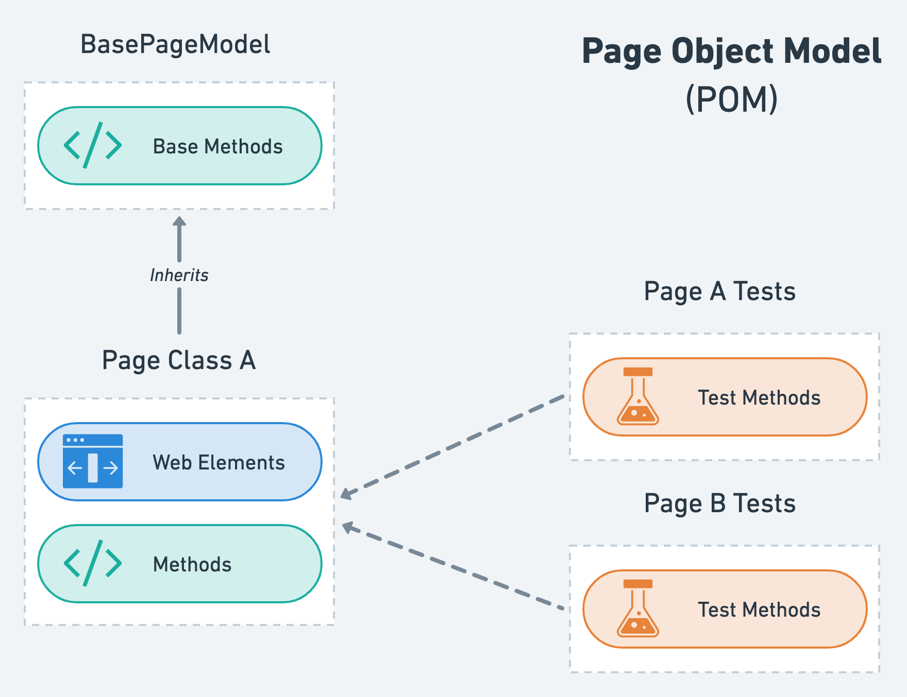

# Getting Started with the Page Object Model using the Playwright End-to-end Testing Framework

The purpose of this guide is to familiarize the reader with the Page Object Model (POM) design pattern for writing highly maintainable and reusable tests using the Playwright end-to-end testing framework. A detailed example of how to implement the POM design pattern is provided, along with an explanation of how global authentication has been set up in this project to allow for sharing the same authenticated session across all of our tests. Finally, after showing the user how to run the E2E testing suite in this project, we will end with a brief look into debugging failing tests in Playwright when running the tests both locally and in a CI environment with GitHub Actions.

A working knowledge of Playwright is highly recommended prior to reading this guide. For more information on how to use Playwright and follow best practices, please refer to the [official Playwright documentation](https://playwright.dev/docs/intro).

## Page Object Model

The end-to-end tests in this project follow a design pattern known as Page Object Model (POM). Under this pattern, operations and user flows in the UI that dictate how a user interacts with the website are separated from the code that tests them. This concept is achieved by representing each page of the application by a self-contained class called a "Page Class" that locates all the web elements specific to the page and contains methods that perform operations on those web elements. The end result is a Page Class that acts as a repository for all page-related data that all tests can access to perform common user operations on the website under test.



The main advantages of using POM are improved test maintenance and reduced code duplication by creating separation between the test code and the page-specific code that models the areas of a web page that a user interacts with. In doing so, we are able to effectively create a highly maintainable testing structure that allows any modifications due to UI changes to all be made in one place - the Page Class.

### Test Structure

The test structure is greatly influenced by POM. Consider an example page called "Login," which serves as our web page where users can sign into their account using a username and password. Our objective is to test a simple flow where the user inputs their username and password, successfully signs into their account and is redirected to the homepage thereafter. Your first instinct may be to write a simple test case that looks something like this:

```javascript
test('should login a new user', async ({ page, baseURL }) => {
  // Click and fill username input field
  const usernameInputLoc = page.locator('input[id="username"]');
  await usernameInputLoc.click();
  await usernameInputLoc.fill('user');
  await expect(usernameInputLoc).toHaveValue('user');

  // Click and fill password input field
  const passwordInputLoc = page.locator('input[id="password"]');
  await passwordInputLoc.click();
  await passwordInputLoc.fill('Passw0rd!');
  await expect(passwordInputLoc).toHaveValue('Passw0rd!');

  // Click the "Sign in" button and check that we have been redirected to the homepage
  const signInButtonLoc = page.locator('button:has-text("Sign in")');
  await Promise.all([
    signInButtonLoc.click()
    page.waitForNavigation(),
  ]);
  await expect(page).toHaveURL(new RegExp(`${baseURL}/`));
});
```

That test was quite simple and straightforward to write. However, the sign in user flow is very common and it is highly likely that we may choose to use this exact same code for a future test, which would lead to duplicated code and poor maintenance potential. POM offers a solution to this problem: create a Page Class that encapsulates this logic and makes it accessible to any test. The full Page Class code is revealed below for the eager reader, but will be decomposed into parts for deeper analysis immediately after.

```javascript
class LoginPageModel extends BasePageModel {
  constructor(page, baseURL) {
    super(page, baseURL, '/login');

    // Locators
    this.usernameInputLoc = page.locator('input[id="username"]');
    this.passwordInputLoc = page.locator('input[id="password"]');
    this.signInButtonLoc = page.locator('button:has-text("Sign in")');
  }

  static create = async (page, baseURL) => {
    const loginPage = new LoginPageModel(page, baseURL);

    await loginPage.init();
    await loginPage.#mockSignIn();

    return loginPage;
  };

  /* USER FLOW OPERATIONS */

  login = async (username, password) => {
    // Click and fill username input field
    await this.usernameInputLoc.click();
    await this.usernameInputLoc.fill(username);
    await expect(this.usernameInputLoc).toHaveValue(username);

    // Click and fill password input field
    await this.passwordInputLoc.click();
    await this.passwordInputLoc.fill(password);
    await expect(this.passwordInputLoc).toHaveValue(password);

    // Click the "Sign in" button and check that we have been redirected to the homepage
    await Promise.all([
      this.page.waitForNavigation(),
      this.signInButtonLoc.click()
    ]);
    await expect(this.page).toHaveURL(new RegExp(`${this.baseURL}/`));
  };

  /* MOCK API HELPERS (INTERNAL) */

  #mockSignIn = async () => {
    await this.page.route('/login', (route, request) => {
      if (request.method() === 'POST') {
        route.fulfill({
          status: 200,
          body: JSON.stringify({
            AuthenticationResult: {
              AccessToken: accessToken,
              RefreshToken: refreshToken,
              TokenType: 'Bearer'
            }
          })
        });
      } else route.fallback();
    });
  };
}
```

Now, let's break down the code above and inspect each part separately:

<details>
  <summary><code>BasePageModel</code></summary>
  <br />

```javascript
  class LoginPageModel extends BasePageModel
```

All Page Classes in this project inherit from the `BasePageModel` class, which is a custom class that provides a base set of functionality and properties that Page Classes can extend from.

</details>

<details>
  <summary><code>constructor</code></summary>
  <br />

```javascript
  constructor(page, baseURL) {
    super(page, baseURL, '/login');

    // Locators
    this.usernameInputLoc = page.locator('input[id="username"]');
    this.passwordInputLoc = page.locator('input[id="password"]');
    this.signInButtonLoc = page.locator('button:has-text("Sign in")');
  }
```

The Page Class constructor is where we locate all of the web elements that a user will be interacting with for the user flows being tested.

</details>

<details>
  <summary><code>create</code> initializer</summary>
  <br />

```javascript
  static create = async (page, baseURL) => {
    const loginPage = new LoginPageModel(page, baseURL);

    await loginPage.init();
    await loginPage.#mockSignIn();

    return loginPage;
  };
```

The `create` static method is used to initialize a new Page Class instance. This is also where we set up all of our mocked API endpoints that are going to be used in our user flow operations for this page (network mocking will be explained in a later step).

You may ask yourself why these creation actions are not done inside the constructor. The reason is that class instantiation is a synchronous operation, whereas our `create` method involves some asynchronous operations that must be awaited when used to set up Playwright fixtures (more on this soon).

</details>

<details>
  <summary><code>login</code> method</summary>
  <br />

```javascript
login = async (username, password) => {
  // Click and fill username input field
  await this.usernameInputLoc.click();
  await this.usernameInputLoc.fill(username);
  await expect(this.usernameInputLoc).toHaveValue(username);

  // Click and fill password input field
  await this.passwordInputLoc.click();
  await this.passwordInputLoc.fill(password);
  await expect(this.passwordInputLoc).toHaveValue(password);

  // Click the "Sign in" button and check that we have been redirected to the homepage
  await Promise.all([
    this.page.waitForNavigation(),
    this.signInButtonLoc.click()
  ]);
  await expect(this.page).toHaveURL(new RegExp(`${this.baseURL}/`));
};
```

Here is the login user flow from earlier. This is almost identical to the code we wrote in our simple test, but has now been encapsulated inside a Page Class so that we can reuse it in multiple places and easily make modifications to it in the case that our UI changes at some point in the future.

</details>

<details>
  <summary>Network mocking</summary>
  <br />

```javascript
  #mockSignIn = async () => {
    await this.page.route('/login', (route, request) => {
      if (request.method() === 'POST') {
        route.fulfill({
          status: 200,
          body: JSON.stringify({
            AuthenticationResult: {
              AccessToken: accessToken,
              RefreshToken: refreshToken,
              TokenType: 'Bearer'
            }
          })
        });
      } else route.fallback()
    });
  };
```

Playwright offers an API for mocking API endpoints by intercepting a request made by a page and fulfilling it with a custom response of our choice. In this example, when calling the `#mockSignIn` function, we are effectively mocking every request that matches the `/login` url pattern so that it returns successfully with a valid set of access and refresh tokens.

You will notice that our network mocking method is given a hash name (`#mockSignIn`), which identifies it as a private instance method whose access is restricted to members of the `LoginPageModel` class.

</details>

Now that we have our Page Class ready to go, we can go ahead and write our test case.

```javascript
const test = baseTest.extend({
  loginPage: async ({ page, baseURL }, use) => {
    const loginPage = await LoginPageModel.create(page, baseURL);
    await use(loginPage);
  }
});

test('should login a new user', async ({ loginPage: { login } }) => {
  await login('testUser', 'Passw0rd!');
});
```

First, we created a new fixture called "loginPage" and attached it to our base test object. In this project, you may also notice this first step written as follows:

```javascript
const test = extendTestFixtures(
  [{ name: 'loginPage', PageModel: LoginPageModel }],
  { isAuthenticated: false }
);
```

`extendTestFixtures` is a custom function that internally calls the `baseTest.extend` function in a similar manner as before, but also adds or extends additional fixtures to the base test object for more complex operations.

From there, we were able to access the `loginPage` fixture from within the test and use it to call our `login` method, which ran the entire sign in user flow and the associated assertions against it. We can take this one step further and add additional logic to make this test case more complete.

```javascript
test('should login a new user', async ({ loginPage: { login }, page }) => {
  await login('testUser', 'Passw0rd!');
  await page.takeScreenshot('user-login');

  // Ensure that navigating back after logging in does not redirect the user back to the login page
  await page.goBack();
  await expect(page).not.toHaveURL('/login');
});
```

In the above example, `page.takeScreenshot` is a custom function that takes a screenshot of the page at the point in time the function is called and saves the resulting PNG file in a pre-determined directory, which in this project is called "screenshots."

Once the initial Page Class has been set up, testing additional user flows is quite straightforward as it simply becomes a matter of adding instance methods for each flow, like "logout", in the Page Class and creating new tests that call those instance methods.

## Global Authentication Setup

A large number of tests require that the user is signed in with a valid user session. To avoid code duplication, Playwright provides a mechanism to reuse the signed-in state globally so that we only need to sign in once and then share the same authenticated session across all of our tests. This mechanism is called "global setup" and it works by running a [script](global-setup.js) before any of the tests in order to execute initialization code. Within this global setup script, we run the same user login operation that we looked at in the previous section, which we will now dissect in greater detail to explain what happens when it makes a request to the mocked `/login` API endpoint.

Internally, the mocked `/login` API endpoint uses the `amazon-cognito-identity-js` package to manually generate long-lived mock Cognito session tokens with the correct format and structure that our frontend session validation logic expects. The response containing these mock Cognito session tokens is then automatically stored in the local storage of the current browser context by the `amazon-cognito-identity-js` package. Since local storage is cleared for each test, we take the opportunity now to read the tokens from the current browser context's local storage and save them in a place called "storageState" that allows us to retrieve them at a later point in time. Storage state would then always contain the same valid access and refresh tokens required to authenticate a user, which are injected into the browser context for each test and used to pre-populate local storage so that our tests can start already in an authenticated state.

To disable global authentication for a specific set of tests, we set the `isAuthenticated` option to `false` when calling the `extendTestFixtures` helper function. This option disables authentication for tests created using the resulting extended test object by clearing all cookies and origins data from the browser context's storage state of those tests. For instance, the following code snippet shows how to set up an extended test object for the Login page tests with authentication disabled.

```javascript
const test = extendTestFixtures(
  [{ name: 'loginPage', PageModel: LoginPageModel }],
  { isAuthenticated: false }
);
```

## Running the Tests

In addition to the regular testing practices and assertions that we have seen thus far, Playwright Test also includes the ability to produce and visually compare screenshots using `await expect(page).toHaveScreenshot()`. Due to differences in how different architectures render fonts and other assets, the tests are run inside a Docker container in order to generate consistent screenshots on any machine. To run the tests locally, navigate into the `web-ui/e2e` directory and run the following command:

```shell
npm run test:e2e
```

This command will install the latest browser binaries, load the mock environment variables from `.env.test`, and create an optimized production build of the application. Subsequently, a new Docker image is created and used to run a Docker container as an executable that runs the `docker-entrypoint.sh` script, which means that once the Docker container has finished executing the entrypoint script, it will immediately clean up and exit. Within this entrypoint script, the tests are run against the served production build of the application.

When a UI change occurs, you will need to update the screenshots to reflect the new changes. To do so, run the following command to pass an `--update-snapshots` flag to Playwright Test:

```shell
npm run test:e2e:update
```

This command will run the tests following the same procedure as above, but will also update any screenshots that have changed. These new screenshots will need to be checked in to your version control to ensure that everyone has the most up-to-date screenshots.

Note that on the very first test run, the tests that include a screenshot assertion will fail since Playwright Test has to generate reference screenshots, called "golden files." To generate a golden file, during the first test run, Playwright Test takes multiple screenshots until two consecutive screenshots are matched and saves the last screenshot to the file system. Subsequent test runs will compare new screenshots against the golden files.

## Debugging

### Local

The most straightforward way to debug failing tests locally is to use the Playwright inspector, which can be launched by running the following command:

```javascript
npm run test:e2e -- --debug
```

Additionally, after every test run, three output directories are created: [playwright-report](playwright-report), [screenshots](screenshots), and [test-results](test-results). Let's take a look at what each one consists of.

1. **playwright-report** is used to serve a HTML report on your local server, which allows you to step through each test and inspect the full execution details. From the HTML report, you may also open the trace file that provides you with a more interactive experience to debug your tests by exploring the recorded actions and visually inspecting what happened during each action.
2. **screenshots** contains all the screenshots that were taken by calling the `page.takeScreenshot` method
3. **test-results** contains all the artifacts generated by Playwright Test upon test completion, including screenshots, videos and traces

All three of these resources offer great insight into the test run and can be helpful in resolving failing tests.

More information on how to debug Playwright tests locally can be found on the [official Playwright documentation](https://playwright.dev/docs/debug).

### CI (GitHub Actions)

#### `playwright-report` Artifact

When running the E2E test suite in GitHub Actions, debugging failing tests can be challenging due to limited visibility into the test results. To help with debugging these failing tests, the same `playwright-report` that is generated when running the tests locally is also saved as an artifact under the workflow summary in the GitHub Actions menu. It is important to mention that, for this project, the `playwright-report` artifact is generated only for workflows that failed at the Playwright testing step and is only retained for a preset number of days before being automatically deleted. Currently, the retention period is set for seven days, but this value can be configured from the [workflow yml file](../../.github/workflows/e2e-test-on-pull-request.yml#L70).

#### `act`

In the instance that the `playwright-report` does not provide sufficient information to debug failing tests, the [act](https://github.com/nektos/act) command line tool can be used to run the GitHub Actions workflow locally. Once you have installed `act` using the [installation instructions](https://github.com/nektos/act#installation) found in the official GitHub repo and made sure to have Docker running, navigate into the root directory of the app and run the following command:

```shell
act pull_request -v -j e2e-tests
```

Note that the `-v` flag enables verbose-logging and is optional.

This command will run the `e2e-tests` job inside of a Docker container that closely resembles the execution environment where workflows run on GitHub. Using `act` provides us with the flexibility to run our E2E tests quicker and more often, while also allowing us to inspect the test execution details more closely.
